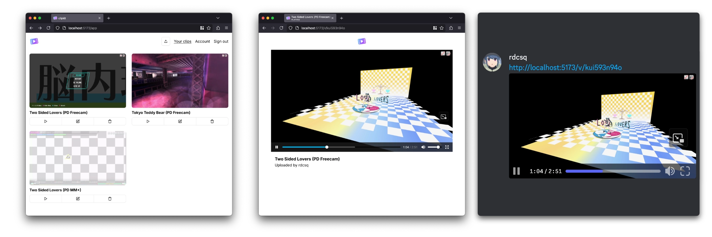

  

<h1 align="center">clipkit</h1>

a video sharing website

## stack

- React Router v7
- PostgreSQL
- S3-compatible storage
- ffmpeg
- Docker

## how to deploy with Docker

- see example [docker-compose.yml](./docker-compose.yml)
- you have to provide your own ffmpeg build. for example: https://johnvansickle.com/ffmpeg/
- for now, migrations have to be done manually, but i plan on adding a migration script.